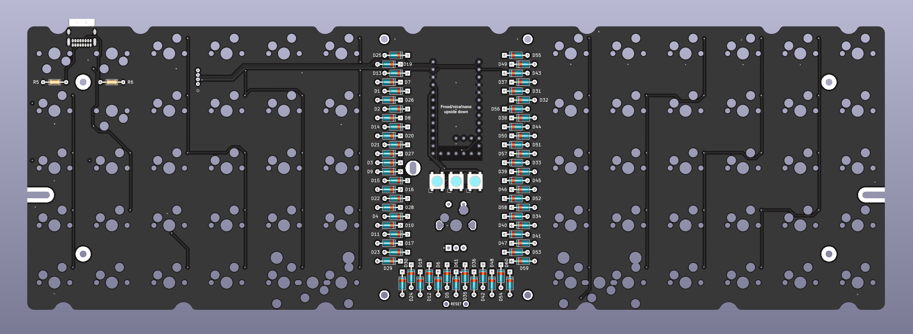

# Lumberjack Pro - Hotswap ortholinear 60% keyboard PCB based on the Frood/nice!nano

Lumberjack is a hotswap split 5x12 ortholinear keyboard PCB based on the Frood or nice!nano controllers, and using mostly through-hole components.

The goal of this project is to build a hotswap ortholinear PCB that fits in many standard 60% tray mount cases.

Inspired by the [Plaid keyboard](https://github.com/hsgw/plaid).

* Designed to be easy to build with minimal soldering experience
* Uses either the modern [Frood](https://42keebs.eu/shop/parts/controllers/frood-rp2040-pro-micro-controller/) (wired) or [nice!nano](https://nicekeyboards.com/nice-nano) (wireless) controllers instead of the old-school 8bit ATmega MCU
* Uses Kailh hotswap sockets for easy switch swaps
* Get that visible component aesthetic in a standard 60% tray-mount case
* Supports both USB Mini and USB-C
* Plateless or with FR4 switch plates

# Kit availability

Complete kits can be purchased at [42. Keebs](https://42keebs.eu/shop/kits/pro-micro-based/lumberjack-pro-hotswap-50-ortho-kit/)

# Ordering parts

See the [Bill of materials](BOM.md) for a detailed list of the required parts.

PCBs can be manufactuered by a variety of online PCB fabricators. You can use [PCBShopper](https://pcbshopper.com/) to search for the best price.

The [zip file in the releases](https://github.com/piit79/lumberjack-pro-keyboard/releases) contains the gerber files your fabricator will need to make the PCB.

When uploading the gerber zip files, use the default PCB settings.

Note that when uploading to JLCPCB, the upload tool may not detect the dimensions of the PCB from the gerber files and may not generate a preview image. This appears to be an issue with JLCPCB and you can manually enter the PCB size as 94.6x285mm.

If you want to use a plate, there are gerbers for an FR4 plate. You will need two plates, one for each half of the keyboard.

# Construction

Solder all the components onto the top side of the PCB except the USB connector which should be on the back of the board. Leave the larger components until last so that the board will lie flat upsidedown while you solder the resistors and capacitors.

Ensure that the diodes are installed in the correct orientation. The square pad is for the side with the black stripe.

See [the build guide](guide.md) for more information.

## Need help?

Have questions or need help, reach out via the [42. Keebs Discord server](https://42keebs.eu/discord) where you will find many helpful Lumberjack owners.

# Firmware

Firmware is available in our [QMK/Vial fork](https://github.com/piit79/vial-qmk/tree/vial/keyboards/42keebs/lumberjack_pro).

Follow the [QMK firmware instructions](https://docs.qmk.fm/#/flashing) to build and flash the firmware.

To put the controller into bootloader mode so it is ready to recieve firmware, do the following:

* A brand new Frood and nice!nano will enter bootloader mode automatically
* On the Frood, hold the BOOT button while pressing the RESET button
* If the Frood is flashed with a QMK/Vial firmware, double-press the RESET button quickly
* On the nice!nano, double-press the RESET button quickly

Once the controller enters the bootloader mode, it will present itself as a USB mass storage device ("USB flash drive"). To flash the firmware .uf2 file, simply copy it to the drive.

# Component cover

Cut a piece of 2mm thick acrylic to size (95x57mm) and drill 4 m2 holes in the corners for the standoffs. Use the PCB or cover.dxf as a guide for the hole positions, you can also use cover.dxf for laser cutting the correct size acrylic.

Affix the 4 standoffs to the PCB with screws from underneath the PCB. Use the remaining 4 screws to attach the acrylic to the top of the standoffs.

# Revisions

## Rev1

* Initial revision using hotswap sockets with support for both Frood and nice!nano controllers
